# Venue Landing Kit

[](./LICENSE)

Un kit Astro SSR per landing di attività locali: un **catalogo di componenti** e un **preset pronto
per verticale** — piscina, ristorazione, bar, hotel — customizzabile via file di config. I dati vivi
(identità, orari, listino) possono arrivare **da un backend HTTP** o **da file committati**, sezione
per sezione: un deploy senza gestionale è un sito statico puro.

## I quattro preset

<table>
<tr>
<td width="50%"><b>piscina</b> — ingressi, ombrelloni, regolamento · <a href=".github/screenshots/preset-piscina.jpg">pagina intera</a><br></td>
<td width="50%"><b>ristorazione</b> — carta, storia, galleria · <a href=".github/screenshots/preset-ristorazione.jpg">pagina intera</a><br></td>
</tr>
<tr>
<td><b>bar</b> — drink list, eventi, dehors · <a href=".github/screenshots/preset-bar.jpg">pagina intera</a><br></td>
<td><b>hotel</b> — camere e tariffe, servizi · <a href=".github/screenshots/preset-hotel.jpg">pagina intera</a><br></td>
</tr>
</table>

Stessa base di componenti, quattro palette e quattro strutture: cambiano solo i file sotto
`presets/`. Le immagini sono generate dalle route `/demo/<preset>` con `npm run screenshots`.

**Il contratto è il codice**: [`src/lib/dto.ts`](src/lib/dto.ts) (endpoint dati live) e
[`src/lib/sections.ts`](src/lib/sections.ts) (catalogo sezioni e shape della struttura). Lo specchio
leggibile del contratto backend è [`BACKEND_CONTRACT.md`](BACKEND_CONTRACT.md).

## Quickstart (demo, zero backend)

```bash
git clone <questo-repo> && cd <cartella>
npm install
cp .env.example .env   # contiene DEMO_MODE=true
npm run dev            # http://localhost:4321
```

Vedrai il preset attivo (piscina) popolato dai suoi dati demo. `curl localhost:4321/health` →
`{"status":"ok","demo":true,"data_source":"demo",...}`.

### Vetrina dei preset (`/demo/<preset>`)

Per vedere **tutti** i verticali senza toccare i due import, con `DEMO_MODE=true` ogni preset ha la
sua pagina di esempio, servita dallo stesso build:

```bash
npm run dev
open http://localhost:4321/demo/piscina       # oppure ristorazione, bar, hotel
```

| Route                | Cosa mostra                                                     |
| -------------------- | --------------------------------------------------------------- |
| `/demo/piscina`      | preset piscina: copy, dati demo e palette di `presets/piscina/` |
| `/demo/ristorazione` | idem per `presets/ristorazione/`                                |
| `/demo/bar`          | idem per `presets/bar/`                                         |
| `/demo/hotel`        | idem per `presets/hotel/`                                       |

Ogni pagina ha una barra in alto per passare da un preset all'altro; menu e ancore restano sulla
pagina demo (`/demo/bar#orari`). Le route sono `noindex` e **fuori da DEMO_MODE rispondono 404**: un
deploy reale serve un solo preset e non espone gli altri.

Come funziona: la route legge `presets/<nome>/index.ts` (contenuto + `DEMO_DATA`) e inietta il
`theme.css` del preset come `<style>` inline, così i token `brand-`/`cta-`/`accent-` vengono
rivalorizzati a richiesta sopra la palette compilata. Un preset nuovo sotto `presets/` compare da
solo. Per il build reale resta valida la regola dei due import (sotto): la vetrina è solo uno
strumento di anteprima. Anche sul build di produzione:

```bash
npm run build && DEMO_MODE=true node ./dist/server/entry.mjs
curl -s -o /dev/null -w '%{http_code}\n' localhost:4321/demo/hotel   # 200
```

## Come è organizzato

| Superficie        | Possiede                                                                                                              |
| ----------------- | --------------------------------------------------------------------------------------------------------------------- |
| `presets/<tema>/` | il verticale: `content.ts` (struttura+copy), `theme.css` (palette), `demo-data.ts`, asset in `public/presets/<tema>/` |
| `site.content.ts` | il file del **deploy**: importa il preset scelto e applica override per sezione; esporta `STATIC_DATA`                |
| `site.config.ts`  | identità per-deploy: `dataSource`, brand asset, `formatting.{locale,currency}`, analytics, fetch                      |
| `src/`            | componenti, degradazione, sicurezza — mai copy di business, mai palette cablata                                       |

### Scegliere il preset

La selezione sono **due import che devono puntare allo stesso verticale** (non esiste un campo
`preset` in config, di proposito: sarebbe una terza dichiarazione libera di divergere dalle due che
fanno fede):

1. il contenuto, in `site.content.ts`:
   ```ts
   import { content as presetContent } from './presets/ristorazione';
   ```
2. il tema, in `src/styles/tokens.css`:
   ```css
   @import '../../presets/ristorazione/theme.css';
   ```

Il tema DEVE stare in quel `@import` (dentro il grafo Tailwind): le utility con opacità inlineano
il colore al build, quindi la palette non è sostituibile a runtime.

### La struttura a sezioni

`site.content.ts` (via preset) è un `SiteContent`: `meta` + un array ordinato di sezioni. Riordinare
l'array riordina la pagina; `{ type, enabled: false }` spegne una sezione (menu e ancore compresi)
senza richiedere altro. Il catalogo:

| `type`         | Componente     | Dati backend                                |
| -------------- | -------------- | ------------------------------------------- |
| `hero`         | Hero           | —                                           |
| `features`     | FeatureGrid    | —                                           |
| `hours`        | OpeningHours   | `/site/opening-hours` (o statici)           |
| `pricing`      | PricingTables  | `/site/pricing` (o statici)                 |
| `services`     | ServiceList    | —                                           |
| `rules`        | RuleGroups     | —                                           |
| `highlight`    | HighlightPanel | —                                           |
| `menu`         | MenuCourses    | — (prezzi come stringhe libere dell'autore) |
| `gallery`      | GalleryGrid    | — (testo tutto opzionale)                   |
| `faq`          | Faq            | — (`<details>` nativi, niente script)       |
| `testimonials` | Testimonials   | — (citazioni redazionali)                   |
| `location`     | Location       | `site.address` (indirizzo + link Maps)      |
| `story`        | Story          | —                                           |
| `rooms`        | RoomsGrid      | — (CTA prenota da `links.booking`)          |

### I componenti, uno per uno

Screenshot dai preset demo. Ogni sezione prende solo `{ id, content }` (più i payload backend dove
indicato sopra): l'aspetto è il tema attivo, il testo è il contenuto del preset.

<table>
<tr>
<td width="50%"><b><code>hero</code></b> — titolo, CTA e card laterale: voci con icona = lista di vantaggi, senza icona = passi numerati<br></td>
<td width="50%"><b><code>features</code></b> — griglia di icone + contatori animati<br>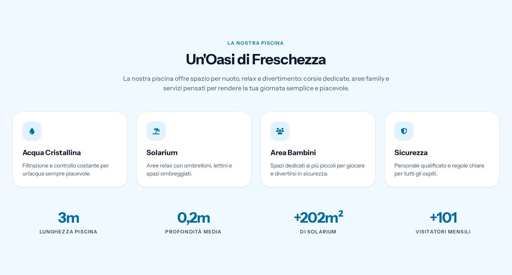</td>
</tr>
<tr>
<td><b><code>hours</code></b> — settimana dal backend, badge sul giorno corrente, card stagione<br>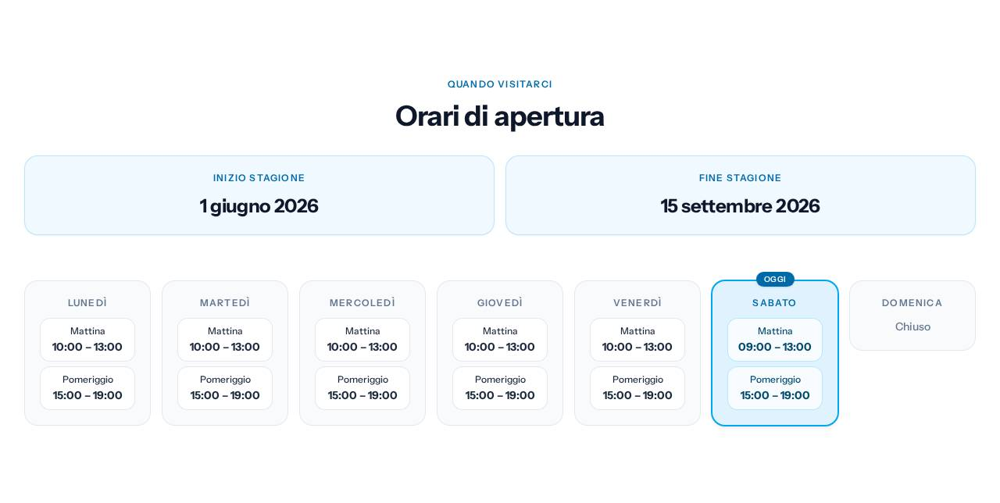</td>
<td><b><code>pricing</code></b> — listino ingressi e abbonamenti dal backend<br>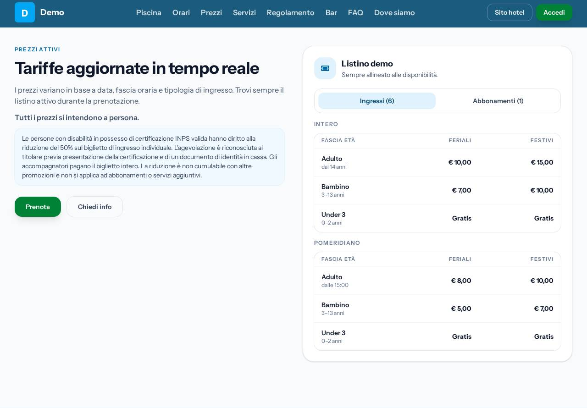</td>
</tr>
<tr>
<td><b><code>menu</code></b> — categorie ad accordion, tab opzionali, link al menu esterno<br>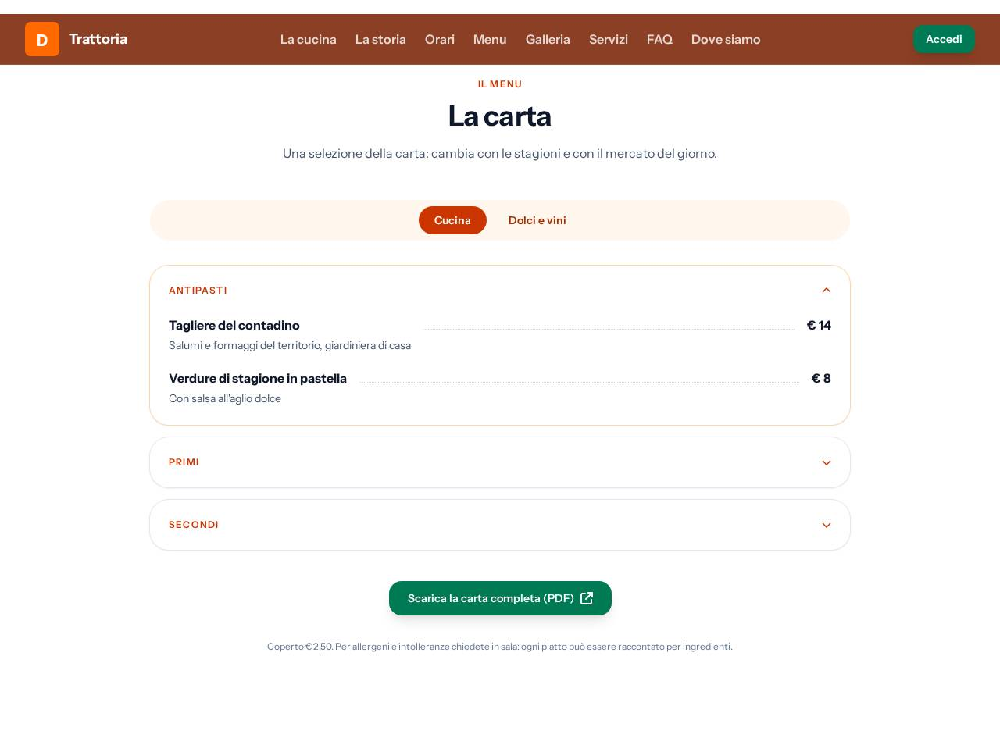</td>
<td><b><code>rooms</code></b> — card camera con dotazioni, prezzo "da" e CTA prenota<br>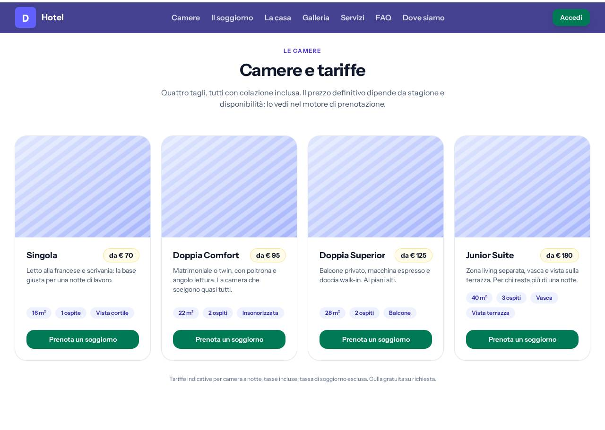</td>
</tr>
<tr>
<td><b><code>services</code></b> — due foto affiancate a un elenco di servizi<br>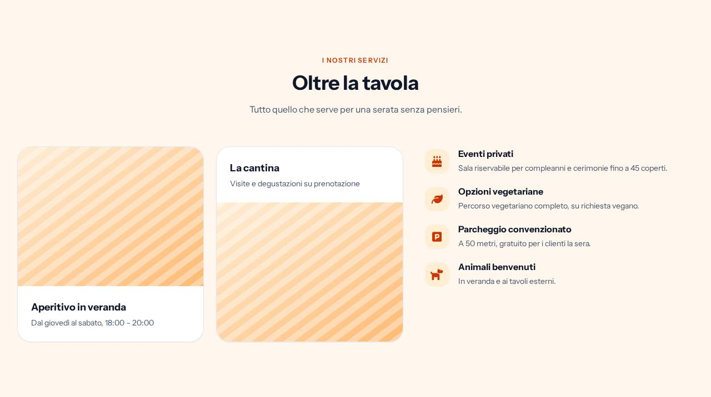</td>
<td><b><code>rules</code></b> — regolamento in gruppi, con toni ammesso/vietato<br>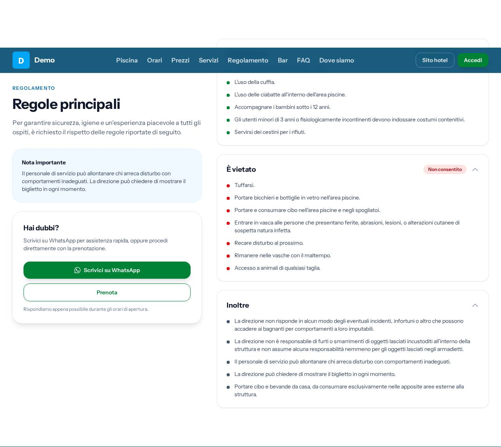</td>
</tr>
<tr>
<td><b><code>highlight</code></b> — pannello scuro per un'area o un'iniziativa<br>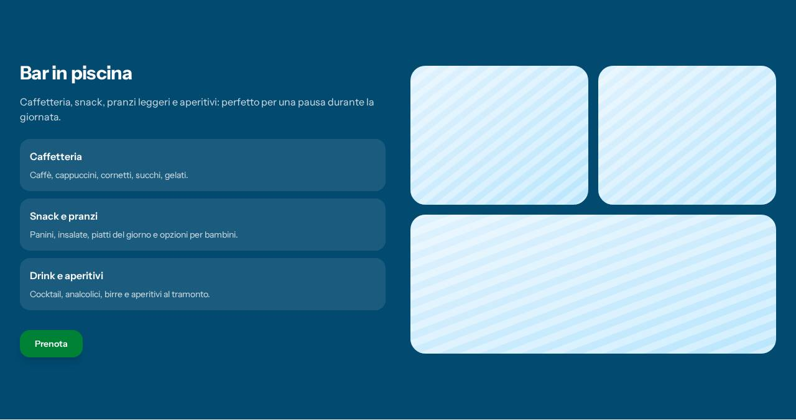</td>
<td><b><code>gallery</code></b> — griglia foto con celle larghe, flusso denso (niente buchi)<br>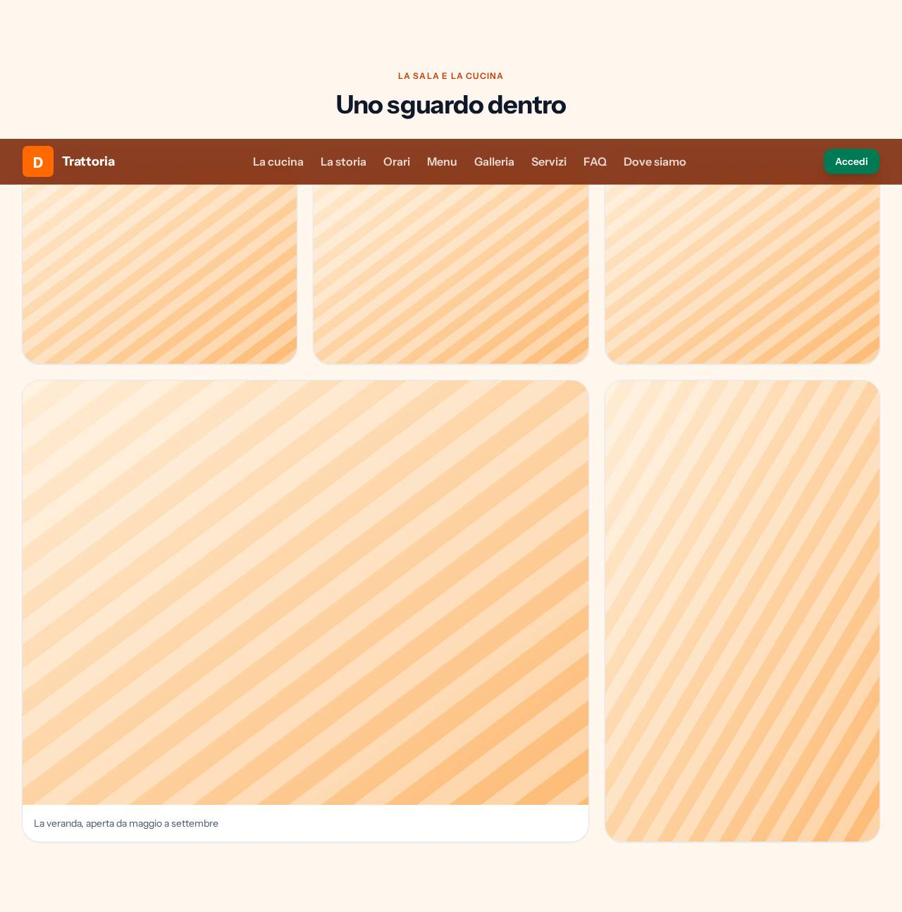</td>
</tr>
<tr>
<td><b><code>story</code></b> — foto affiancata a qualche paragrafo di racconto<br></td>
<td><b><code>testimonials</code></b> — citazioni con autore e valutazione<br></td>
</tr>
<tr>
<td><b><code>faq</code></b> — domande in <code>&lt;details&gt;</code> nativi, senza JavaScript<br>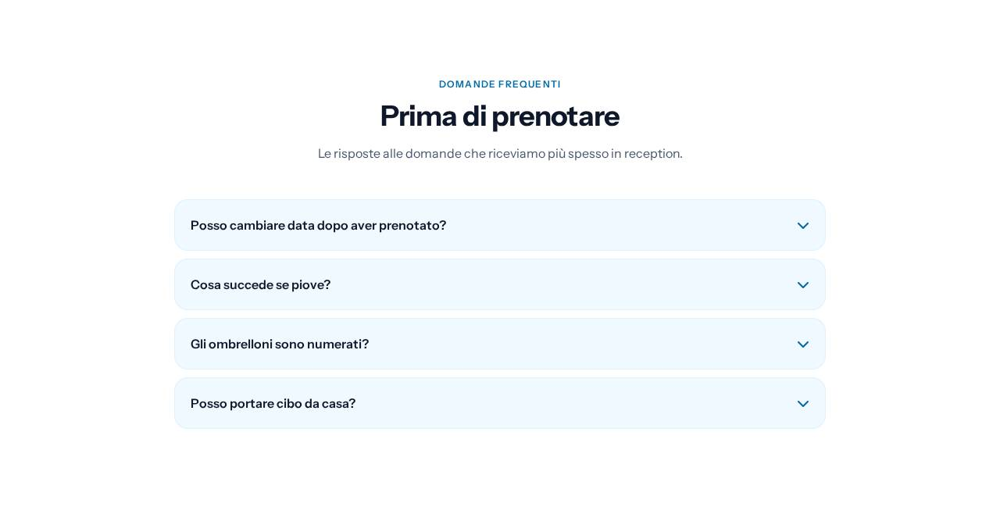</td>
<td><b><code>location</code></b> — indirizzo e link Maps dal backend, più come arrivare<br>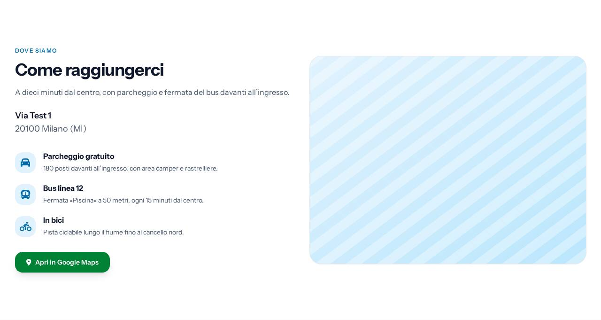</td>
</tr>
</table>

### Fonte dati: backend, statica, o mista

`site.config.ts` dichiara `dataSource: 'backend' | 'static'`; le sezioni `hours`/`pricing` possono
fare override con `data.source`. In modalità statica i payload arrivano da `STATIC_DATA`
(esportata da `site.content.ts`, default: i dati demo del preset — sostituiscili coi dati reali) e
**non esiste il percorso 503**: il sito è self-contained. `DEMO_MODE=true` forza static ovunque.
`/health` riporta `data_source: 'backend' | 'static' | 'demo' | 'mixed'` e degrada solo se il
deploy dipende davvero da un backend giù.

## White-labeling di un deploy

1. Fork; scegli il preset (i due import sopra).
2. Override di copy in `site.content.ts` (sostituzione esplicita per sezione — esempio nel file).
3. `site.config.ts`: `dataSource`, `formatting`, asset brand (`logoUrl`/`faviconUrl`/`ogImageUrl`
   accettano URL assoluto o path da `public/`; l'OG **deve** restare raster 1200×630 — i crawler
   social non rendono SVG).
4. Sostituisci gli asset: `public/brand/` (identità) e le foto del preset.
5. Riscrivi i legali in `src/content/legal/` (Markdown; il titolare arriva da `site.gdpr` quando i
   dati sono backend) e falli validare.
6. Env del deploy:

   | Var                         | Richiesta          | Default                               | Uso                                                                   |
   | --------------------------- | ------------------ | ------------------------------------- | --------------------------------------------------------------------- |
   | `DEMO_MODE`                 | no                 | `false`                               | `true` = serving statico coi dati demo del preset                     |
   | `API_BASE_URL`              | solo backend/mixed | `http://127.0.0.1:8000/api/public/v1` | root del backend; URL = `${API_BASE_URL}/${FACILITY_SLUG}/<endpoint>` |
   | `FACILITY_SLUG`             | solo backend/mixed | `demo`                                | struttura servita; verificato contro `SitePayload.slug` (warning)     |
   | `API_AUTH_TOKEN`            | solo backend/mixed | —                                     | Bearer su ogni chiamata (non `/up`); server-only                      |
   | `PUBLIC_SITE_URL`           | sì                 | `http://localhost:4321`               | canonical, sitemap, OG                                                |
   | `CACHE_TTL_SECONDS`         | no                 | `300`                                 | TTL cache in-process                                                  |
   | `PUBLIC_GA4_MEASUREMENT_ID` | no                 | —                                     | GA4 consent-mode v2 (vuoto = niente tag)                              |
   | `PORT` / `HOST`             | no                 | default Astro                         | bind del server                                                       |

7. Build e avvio:
   ```bash
   npm ci && npm run build
   node ./dist/server/entry.mjs   # env dal process manager, non da .env
   ```
   PM2/systemd per i restart; Nginx/Caddy davanti per TLS e per servire `dist/client/`.
   Smoke-test: `curl https://<sito>/health`.

## Comandi

| Comando                               | Scopo                                                          |
| ------------------------------------- | -------------------------------------------------------------- |
| `npm run dev` / `build` / `preview`   | dev server · build SSR · esecuzione del build con `.env`       |
| `npm run check`                       | `astro check` + `tsc --noEmit`                                 |
| `npm run lint` / `format`             | ESLint · Prettier (`format:check` è gate CI)                   |
| `npm test`                            | unit (Vitest) — include le guardie su temi, wiring e contratto |
| `npm run test:e2e[:degraded\|:empty]` | Playwright su mock backend / backend giù / payload vuoti       |
| `npm run test:lh`                     | Lighthouse (manuale, non gate CI)                              |
| `npm run screenshots`                 | rigenera `.github/screenshots/` dalle route `/demo/<preset>`   |

Le suite E2E derivano le attese dalla struttura committata: il re-theme non le rompe.

## Contribuire

Vedi [CONTRIBUTING.md](./CONTRIBUTING.md). Sicurezza: [SECURITY.md](./SECURITY.md).
Licenza [MIT](./LICENSE).
